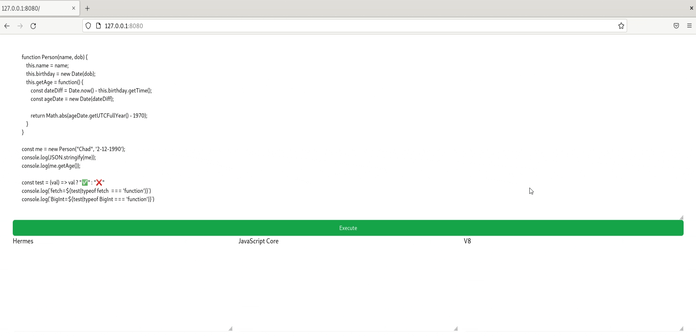

# can-i-use-js-engine

> Run JavaScript code in multiple JavaScript engines at once to test compatibility!



## Usage

Linux only
```
yarn install
yarn start
# Now visit http://127.0.0.1:8080
```

## Warnings
* **Definitely not production ready and definitely insecure**.
* JSC is compiled by me, dynamically and will likely fail on your system, recompile it